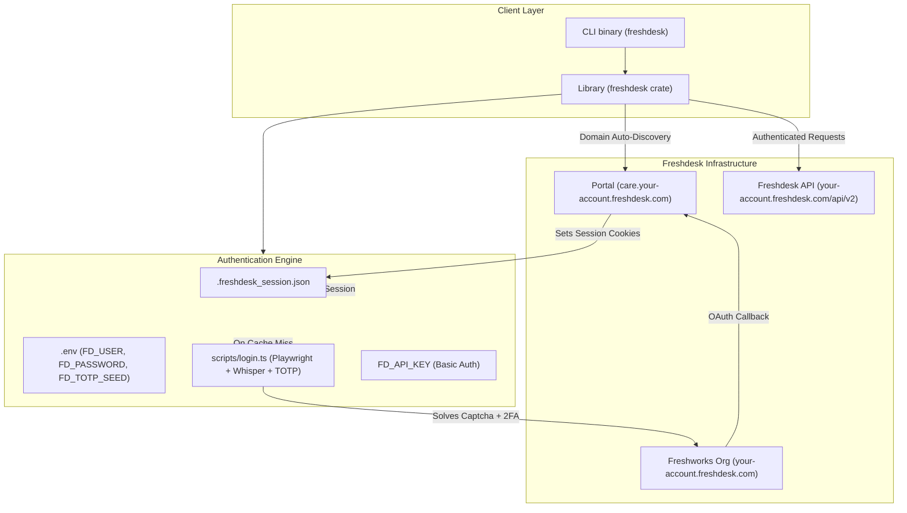

# Architecture & Design

This document details the architecture, design choices, and data flow of the `freshdesk` Rust client and CLI.

## System Overview

---

## 1. Domain Resolution

Freshdesk v2 REST APIs are served strictly on canonical `*.freshdesk.com` domains (e.g., `your-account.freshdesk.com`). Custom vanity CNAMEs (such as `care.your-account.freshdesk.com`) host the customer-facing support portal and will return HTTP `404` for `/api/v2/*` endpoints.

The client features automated domain discovery in `resolve_canonical_freshdesk_domain()`:
1. If the provided server already ends with `.freshdesk.com`, it is used as-is.
2. If a custom domain is supplied, the client issues a non-redirecting `GET /en/support/login`.
3. It parses the `Location` response header and extracts the `hd` parameter (e.g. `hd=your-account.freshdesk.com`).
4. All subsequent API queries are automatically dispatched to the canonical endpoint.

---

## 2. Authentication Subsystem (`src/auth.rs`)

Freshdesk supports two primary authentication modes:

1. **API Key (Basic Auth)**:
   - Header: `Authorization: Basic base64(<api_key>:X)`
   - Used when `FD_API_KEY` is set or `--api-key` is supplied.

2. **Session Cookies (Agent Session)**:
   - Header: `Cookie: _helpkit_session=...; user_credentials=...; session_token=...; ...`
   - Required for agent accounts that lack administrative privileges to generate dedicated API tokens.
   - When credentials (`FD_USER`, `FD_PASSWORD`, `FD_TOTP_SEED`) are present, the client checks for an existing session file (`.freshdesk_session.json` or `~/.freshdesk_session.json`). If absent or expired, it automatically invokes `scripts/login.ts` via Bun.

### Automated Agent Login Engine (`scripts/login.ts`)

- **Browser Automation**: Uses Playwright with stealth configurations (`--disable-blink-features=AutomationControlled`).
- **reCAPTCHA Invisible Solver**: Detects Google reCAPTCHA v2 audio challenges, downloads the audio payload, converts it via `ffmpeg`, and transcribes it locally in < 300ms using `whisper-cli` with the `ggml-tiny.en` model.
- **Two-Factor Authentication**: Implements RFC 6238 HMAC-SHA1 to compute the 6-digit TOTP code from `FD_TOTP_SEED`.
- **Cookie Export**: Serializes all session cookies into `.freshdesk_session.json`.

---

## 3. Resilience & Rate-Limiting

The Freshdesk API enforces rate limits per minute (typically 100 to 700 requests/minute depending on plan), returning HTTP `429 Too Many Requests` with a `Retry-After` header.

`FreshdeskClient::get_json` implements automatic backoff and retry:
- Intercepts HTTP `429` status responses.
- Reads `Retry-After` (defaults to 2 seconds if omitted).
- Sleeps asynchronously (`tokio::time::sleep`) and retries up to 3 times before returning `FreshdeskError::RateLimited`.

---

## 4. Query & Search Architecture (`src/query.rs`)

Freshdesk splits ticket retrieval across two distinct endpoints:

| Feature | Endpoint | Capabilities | Limitations |
|---|---|---|---|
| **List Tickets** | `GET /api/v2/tickets` | Predefined filters, sorting by standard fields, embedding `requester`, `stats`, `description`. | Cannot filter by custom fields (`_Components`). |
| **Search Tickets** | `GET /api/v2/search/tickets?query="..."` | Full query expressions (`created_at:>'...' AND cf__components:'...'`). | Max 30 results per page, max 10 pages (300 tickets). |

The client provides:
- `ListTicketsQuery`: Builder for the list endpoint with pagination and embed options.
- `SearchTicketsQuery` / `TicketSearchBuilder`: Fluent builder for Lucene query expressions.
- `search_all_tickets_paginated`: Transparently handles paging across result sets up to the maximum total.
